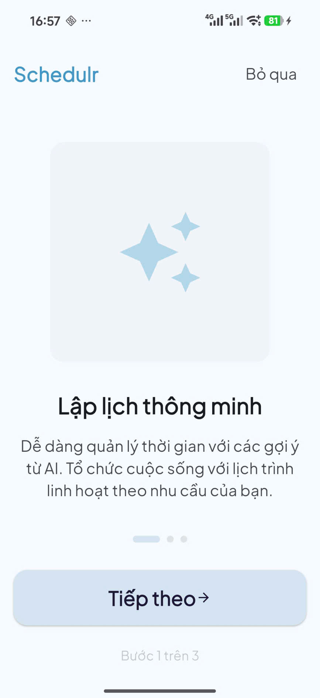
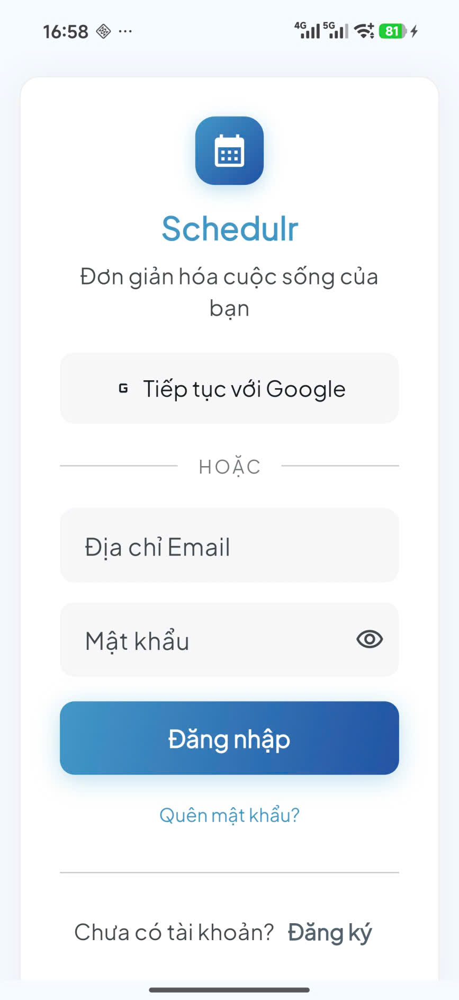
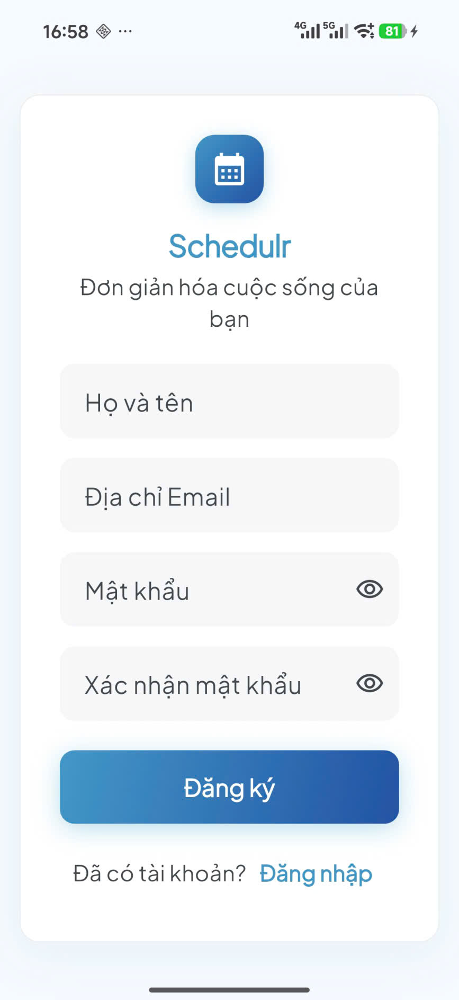
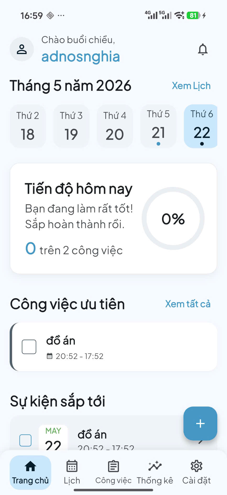
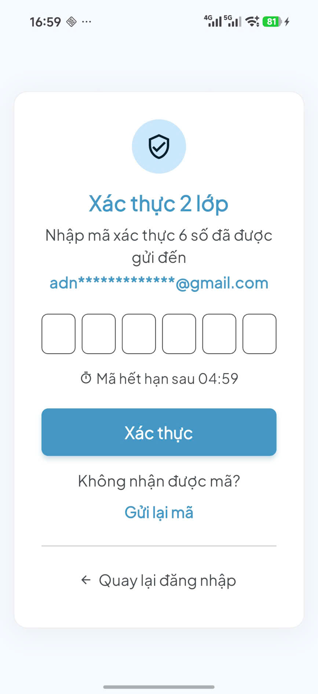
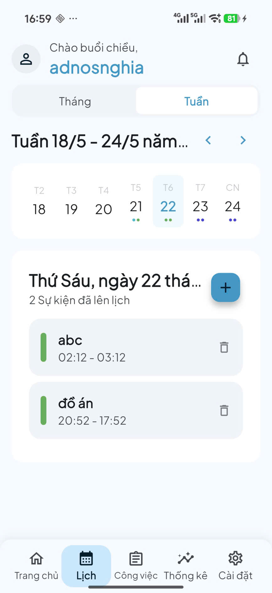
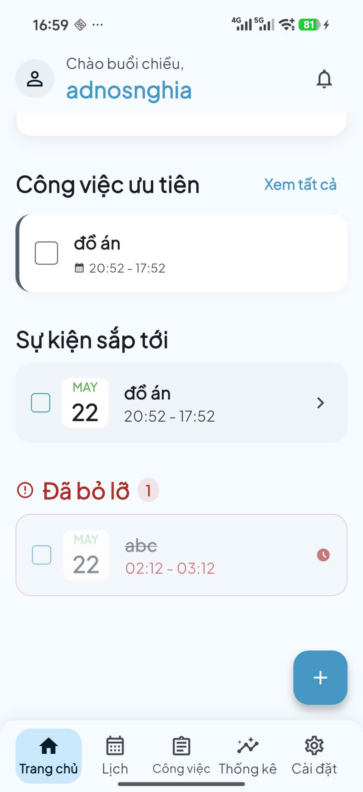
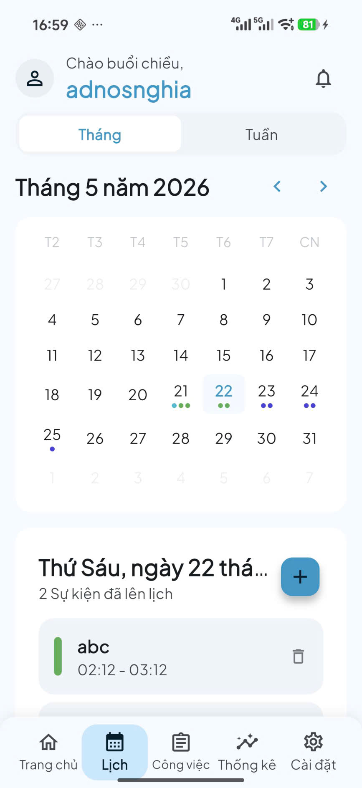

<div align="center">
  <h1>📱 Schedulr - Ứng dụng Quản lý Lịch trình Cá nhân</h1>
  <p>Đồ án môn học: Phát triển ứng dụng di động đa nền tảng (Flutter)</p>
</div>

---

## 📸 Giao diện ứng dụng chính

<p align="center">
  
  
  
  
  
  
  
  
</p>

> **Lưu ý:** Bạn có thể xem thêm các hình ảnh giao diện khác tại thư mục `screenshots/`.

## 🚀 Giới thiệu (About)

**Schedulr** là một ứng dụng di động đa nền tảng được thiết kế chuyên biệt để giúp người dùng quản lý thời gian, công việc và các sự kiện trong ngày một cách thông minh, trực quan và khoa học.

## ✨ Tính năng nổi bật (Features)

* 🔐 **Xác thực người dùng:** Đăng nhập, đăng ký tài khoản an toàn (Hỗ trợ xác thực 2 lớp).
* 📊 **Tổng quan (Dashboard):** Theo dõi nhanh các công việc cần làm và sự kiện sắp diễn ra.
* 📅 **Quản lý Lịch trình (Calendar):** Thêm mới, chỉnh sửa, xóa sự kiện. Hỗ trợ xem lịch linh hoạt theo ngày/tuần/tháng.
* ✅ **Quản lý Công việc (Tasks):** Phân loại, đánh giá mức độ ưu tiên công việc dựa trên **Ma trận Eisenhower**.
* 🔔 **Thông báo (Notifications):** Hệ thống nhắc nhở thông minh sử dụng Local Notifications.
* 📈 **Thống kê & Báo cáo (Analytics):** Báo cáo trực quan bằng biểu đồ về hiệu suất làm việc và tỷ lệ hoàn thành công việc.
* 🎨 **Cài đặt & Cá nhân hóa:** Hỗ trợ chế độ tối (Dark Mode), và tuỳ chọn đa ngôn ngữ.

## 🛠 Công nghệ sử dụng (Tech Stack)

* **Framework:** [Flutter](https://flutter.dev/) (Dart)
* **Backend & Cơ sở dữ liệu:** [Firebase](https://firebase.google.com/) (Firebase Authentication, Cloud Firestore)
* **State Management:** Provider
* **IDE Khuyên dùng:** VS Code / Android Studio

## 💻 Hướng dẫn Cài đặt & Chạy ứng dụng

1. **Yêu cầu môi trường:**
   * Cài đặt [Flutter SDK](https://docs.flutter.dev/get-started/install).
   * Chuẩn bị sẵn máy ảo (Android Emulator / iOS Simulator) hoặc kết nối thiết bị thật.

2. **Clone dự án & Cài đặt:**
   ```bash
   git clone <repository_url>
   cd nhom16_quanlylichtrinhcanhan
   flutter pub get
   ```

3. **Khởi chạy ứng dụng:**
   ```bash
   flutter run
   ```

## 👥 Nhóm Thực Hiện (Nhóm 16)

* 2224802010365 - Huỳnh Văn Sang
* 2224802010857 - Trần Đại Nghĩa

---
*Dự án được thực hiện nhằm mục đích phục vụ đồ án/báo cáo môn học Phát triển ứng dụng di động đa nền tảng.*
